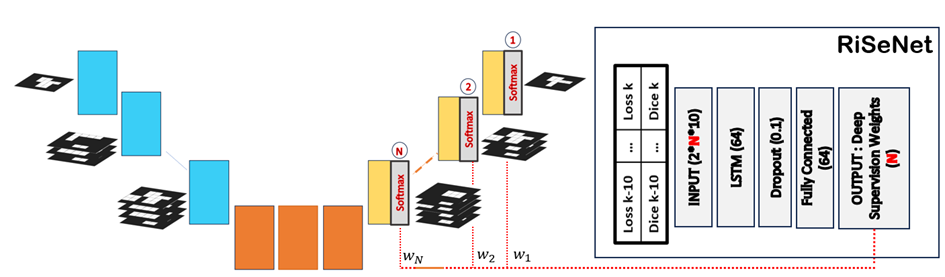

# RiSeNet

**Reinforcement Learning on Deep Supervision**

A reinforcement learning framework that dynamically optimizes deep supervision weights during training for improved segmentation performance.



## What is RiseNet?

RiseNet uses reinforcement learning to automatically adjust deep supervision weights in real-time during training, replacing static weight configurations with adaptive optimization.

### Key Principles:
1. **Dynamic Weight Optimization**: RL agent learns optimal deep supervision weights based on performance feedback
2. **Real-time Adaptation**: Weights evolve during training without manual intervention  
3. **Performance-driven Learning**: Reward system based on loss improvement and segmentation quality

## Installation

```bash
git clone https://github.com/AmelImeneHB/RiSeNet.git
cd risenet
pip install -r requirements.txt
```

## Usage

### With nnU-Net:
```bash
# Replace standard nnU-Net trainer with RiseNet
nnUNetv2_train DATASET_ID 3d_fullres FOLD -tr nnUNetTrainer_RL
```

### Standalone:
```python
from risenet import RLDeepSupervisionWrapper, ConvergenceOptimizer

# Initialize RL optimizer
optimizer = ConvergenceOptimizer(num_levels=5)
loss_fn = RLDeepSupervisionWrapper(base_loss, optimizer)

# Use in training loop
loss = loss_fn(predictions, targets)
```

## Research Paper

For detailed methodology and experimental results, see our paper: https://ieeexplore.ieee.org/abstract/document/10981041 

## Citation

```bibtex
@software{RiSeNet,
  title={3D Semantic Segmentation of Airway Abnormalities on UTE-MRI with Reinforcement Learning on Deep Supervision},
  author={Amel Imene Hadj Bouzid; Fabien Baldacci; Baudouin Denis De Senneville; et al.},
  year={2025},
  url={https://github.com/AmelImeneHB/RiSeNet}
}
```
